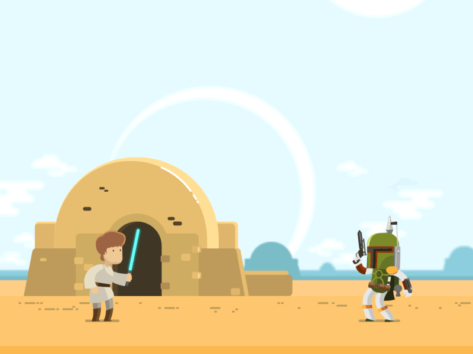

## Hello! I'm Emerson Seiler 👋

### Good to see you here! &nbsp;

    I am a Development Lead at Sparti Health Tech, specializing in planning and implementing solutions that transform public and private healthcare management.
    I have over 10 years of experience in the healthcare field.
    Career Highlights:
    Leadership in the development of critical systems for the healthcare sector, including BI tools for municipal data management and epidemiological management systems.
    Hands-on experience in all phases of the project lifecycle, from planning and deployment to implementation.
    Committed to technological innovation, I maintain a YouTube channel (https://www.youtube.com/emersonseiler) about homelab and technology, sharing knowledge with the community.
    Constantly striving to apply cutting-edge technologies to improve operational efficiency and the quality of healthcare services.
    Previous career in Engineering within the medical/hospital segment, where I held technical and managerial roles in hospitals and clinics of various sizes, contributing to the optimization and operationalization of medical equipment.

## 🛠 &nbsp;Tech Stack
  
Expertise in Next.js, TypeScript, Python, Java, Docker, and DevOps, with a focus on creating scalable and efficient solutions.

## ☕ &nbsp; Can I have a coffee please?

<!--  -->
<!--  -->

## 💰 &nbsp; Donate a pix?

