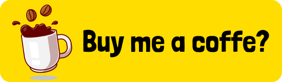

## Hello! I'm Emerson Seiler 👋

### Good to see you here! &nbsp;

    Full Stack Developer and Technical Lead with an Engineering background, 
    specialized in architecting and building end-to-end software ecosystems. 
    Over 3 years of hands-on experience leading development in a startup environment, 
    transforming business challenges into software solutions, with a primary focus 
    on Next.js and Docker. Strong expertise across the entire stack, including 
    back-end implementation with Java (Spring Boot) and Python.

## 🛠 &nbsp;Tech Stack
  
    Expertise in Next.js, TypeScript, Python, Java, Docker, and DevOps, with a 
    focus on creating scalable and efficient solutions.

## 🌊 &nbsp;Alaga Help
  
    Alaga Help is a SaaS focused on flood registration, which uses this information to
    populate maps and create a broader overview of flooding and inundation points. 
    It is a great starting point for a notification system for incidents resulting from 
    severe weather.
    Watch on youtube: https://youtu.be/FQ6Kq_sIgZk

## ☕ &nbsp; Can I have a coffee please?

<!--  -->
<!--  -->

## 💰 &nbsp; Donate a pix?

